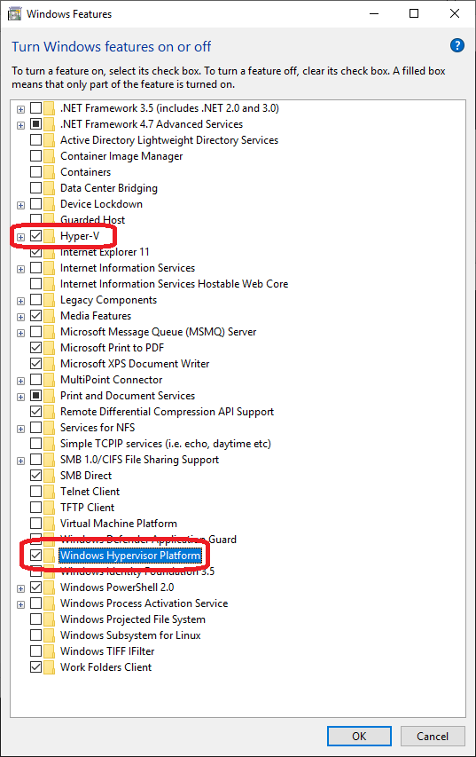
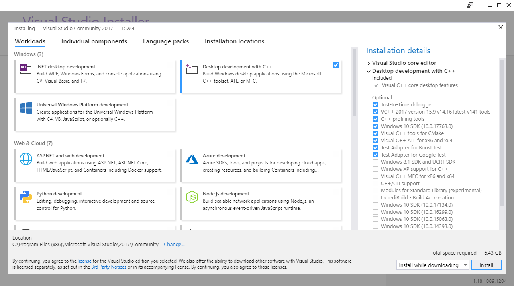
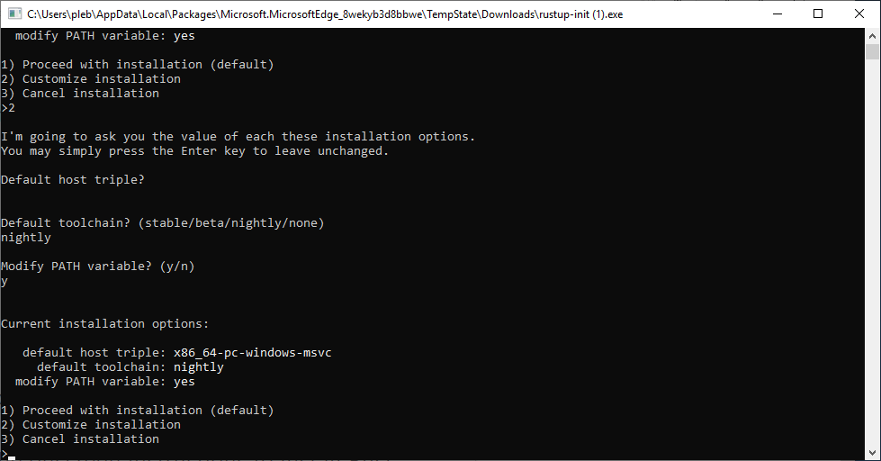
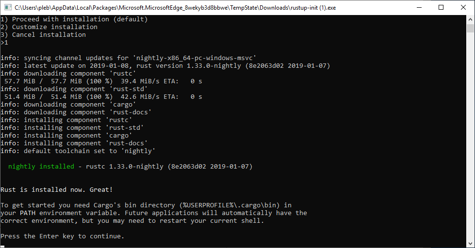

# applepie, a hypervisor implementation for Bochs

Hello! Welcome to applepie! This is a tool designed for fuzzing, introspection, and finding bugs! This is a hypervisor using the Windows Hypervisor Platform API present in recent versions of Windows (specifically this was developed and tested on Windows 10 17763). Bochs is used for providing deep introspection and device emulation.

The Windows Hypervisor Platform API (WHVP) is an API set for accessing Hyper-V's hypervisor abilities. This API makes it easy for us to implement a virtual machine all in user-space without any special drivers or permissions needed.

# Follow me on Twitter for updates

This is a rapidly developing project. I'll probably tweet when new features go out before they get documented.

[@gamozolabs](https://twitter.com/gamozolabs)

# Recent Feature Demo

[](https://www.youtube.com/watch?v=qErEb5h9CwA)

# Binary Coverage Example

[](https://www.youtube.com/watch?v=S1D433EwktE)

# Mascot

I like to have physical things for my projects:

[apple pie squishable](http://www.squishable.com/pc/comfortfood_apple_pie/comfort_food/Comfort+Food+Apple+Pie)

# What is this for?

This is a tool designed for fuzzing and introspection during security research. By using a hypervisor common fuzzing techniques can be applied to any target, kernel or userland. This environment allows fuzzing of whole systems without a need for source of the target. At the hypervisor level code coverage can be gathered, and if needed Bochs emulation can be used to provide arbitrary introspection in an emulation environment. This coverage information can be used to figure out the effectiveness of the fuzz cases. A fuzz case that caused an increase in coverage can be saved as it was an interesting case. This input can be used later, built on by new corruptions.

Snapshot fuzzing is the primary use of this tool. Where you take a snapshot of a system in a certain state, and save it off. This snapshot can then be loaded up for fuzzing, where a fuzz case is injected, and it's resumed. Since the VM can be reset very cheaply, the VM can be reset often. If it takes Word 5 seconds to boot, but you can snapshot it right as it reads your file, you can cut the fuzz case down to only what is relevant to an input. This allows for a very tight loop of fuzzing without needing to have access to source. Since the VM's are entirely separate systems, many can be run in parallel to allow scaling to all cores.

Currently this tool only supports gathering code coverage, dynamic symbol downloading for Windows, and symbol/module parsing for Windows targets as well. Adding fuzzing support will be quite soon.

# Development cycle

Given I've written almost all the features here before (coverage, fuzzing, fast resets, etc). I expect this project should pretty quickly become ready for fuzzing, unless I get distracted :D

I'm aiming for end-of-January for coverage (done!), feedback, module listings (done!), process lists, fast resets, and symbol support (done!). Which would make it a very capable fuzzer.

# OS Support

The main supported target is modern Windows 10. Windows targets have downloading of symbols from the symbol store. This allows for symbolic coverage in Windows targets out of the box. However, the code is written in a way that Linux enlightenment can easily be added.

Without any enlightment, any OS that boots can still be fuzzed and basic coverage can be gathered.

Before reporting OS support issues please validate that the issue is in the hypervisor/changes to Bochs by trying to boot your target using standard prebuilt Bochs with no hypervisor. Bochs is not commonly used and can frequently have breaking bugs for even common things like booting Linux. Especially with the rapid internal changes to CPUID/MSR usages with Spectre/Meltdown mitigations going into OSes.

# Issues

See the issues page on Github for a list of issues. I've seeded it with a few already. Some of these need to be addressed quickly before fuzzing development starts.

# Building

## Build Prereqs

To build this you need a few things:

- Recently updated MSVC compiler (Visual Studio 2017)
- Nightly Rust (https://rustup.rs/ , must be nightly)
- Python (I used 3 but 2 should work too)
- 64-bit cygwin with autoconf and GNU make packages installed
- Hyper-V installed and a recent build of Windows 10

#### MSVC

Install Visual Studio 2017 and make sure it's updated. We're using some bleeding edge APIs, headers, and libraries here.

I was using `cl.exe` version: `Microsoft (R) C/C++ Optimizing Compiler Version 19.16.27025.1 for x64`
And SDK version `10.0.17763.0`

#### Nightly Rust

Install Rust via https://rustup.rs/. I used `rustc 1.32.0-nightly (b3af09205 2018-12-04)`

Make sure you install the `x86_64-pc-windows-msvc` toolchain as only 64-bit is supported for this project.

Make sure `cargo` is in your path. This should be the default.

#### Python

Go grab python https://www.python.org/ and make sure it's in your PATH such that `python` can be invoked.

#### Cygwin

Install 64-bit Cygwin (https://www.cygwin.com/setup-x86_64.exe) specifically to `C:\cygwin64`. When installing Cygwin make sure you install the `autoconf` and `make` packages.

#### Hyper-V

Go into "Turn Windows features on or off" and tick the checkbox next to "Hyper-V" and "Windows Hypervisor Platform". This requires of course that your computer supports Hyper-V.

## Step-by-step build process

This install process guide was verified on the following:
```
Clean install of Windows 10, Build 17763
rustc 1.33.0-nightly (8e2063d02 2019-01-07)
Microsoft (R) C/C++ Optimizing Compiler Version 19.16.27025.1 for x64
Visual Studio Community 2017 version 15.9.4
applepie commit `f84c084feb487e2e7f31f9052a4ab0addd2c4cf9`
Python 3.7.2 x64
git version 2.20.1.windows.1
```

- Make sure Windows 10 is fully up to date
	- We use some bleeding edge features with WHVP and only latest Windows 10 is tested
- In "Turn Windows features on or off"
	- Tick "Hyper-V"
	- Tick "Windows Hypervisor Platform"
	- Click ok to install and reboot



- Install VS Community 2017 and updated
	- Desktop development with C++



- Install Rust nightly for x86_64-pc-windows-msvc


- Install Git
	- Configure git to checkout as-is, commit unix-style
	- If git converts on checkout the ./configure script will fail for Bochs due to CRLF line endings
	- This is core.autocrlf=input
	- You can also use checkout as-is, commit as-is
	- This is core.autocrlf=false
- Install Cygwin x64 via setup-x86_64.exe
	- Install to "C:\cygwin64"
	- Install autoconf package (`autoconf` package)
	- Install GNU make (`make` package)
- Install Python
	- I installed Python 3 x64 and added to PATH
	- Python 2 and 32-bit versions should be fine, we just use Python for our build script
- Open a "x64 Native Tools Command Prompt for VS 2017"
- Checkout applepie via `git clone https://github.com/gamozolabs/applepie`
- cd into applepie
- Run `python build.py`
	- This will first check for some basic system requirements
	- It will build the Rust bochservisor DLL
	- It will then configure Bochs via autoconf
	- It will then build Bochs with GNU make from Cygwin

This initial build process may take about 2 minutes, on a modern machine it's likely 20-30 seconds.

## Actually Building

Just run `python build.py` from the root directory of this project. It should check for sanity of the environment and everything should "just work".

## Cleaning

Run `python build.py clean` to clean Bochs and Rust binaries.

Run `python build.py deepclean` to completely remove all Bochs and Rust binaries, it also removes all the configuration for Bochs. Use this if you reconfigure Bochs in some way.

# Usage

Read up on Bochs configuration to figure out how to set up your environment. We have a few requirements, like `sync=none`, `ips=1000000`, and currently single processor support only. These are enforced inside of the code itself to make sure you don't shoot yourself in the foot.

Use the included `bochservisor_test\bochsrc.bxrc` and `bochservisor_test_real\bochsrc.bxrc` configurations as examples. `bochservisor_test_real` is likely the most up to date config you should look at as reference.

# Coverage

Windows targets have module list enlightenment, which allows us to see the listings for all the modules in the context we are running in. With this we can convert the instruction addresses to module + offset. This module + offset helps keep coverage information between fuzz cases where ASLR state changes. It also allows for the module to be colored in a tool like IDA to visually see what code has been hit.

For Windows targets, symbols will be dynamically downloaded from the symbol store using your `_NT_SYMBOL_PATH` and using `symchk`. Without `symchk` in the path it will silently fail. With symbols a nice human-readable version of coverage can be saved for viewing. Further, with private symbols the coverage can be converted to source:line such that source code can be colored.

# Tests

Okay there aren't really tests, but there's `bochservisor_test` which is a tiny OS that just verifies that everything boots with the hypervisor.

There's then `bochservisor_test_real` which is a configuration I use for things like Windows/Linux. This is the one that will probably get updated most frequently.

# Architecture

## Basics

This codebase introduces a small amount of code to Bochs to allow modular access to CPU context, guest physical to their backing memory, and stepping both device and CPU state.

The main code you want to look at is in `lib.rs` in the `bochservisor` Rust project.

## CPU Loop

In the main CPU loop of Bochs we instead `LoadLibrary()` to load the `bochservisor` DLL. This DLL exports one routine which is the Rust CPU loop which will be invoked.

Bochs will pass a structure to this `bochs_cpu_loop` routine which will contain function pointers to get information from Bochs and to step the device and CPU state in it.

## MMIO / I/O

When MMIO or I/O occurs, the hypervisor will exit with a memory fault or an I/O instruction fault. While WHVP does provide an emulation API it's really lacking and not sufficient.

Rather we use Bochs which is already there and step through a few instructions. By keeping the hypervisor CPU state in sync with Bochs we can dynamically switch between hypervisor and emulation at any time (or at least we should be able to).

This means that the full hypervisor state is always in sync with Bochs and thus things like Bochs snapshots should work as normal and could be booted without the hypervisor (except maybe some CPUID state which needs to be stored in the snapshot info).

When MMIO or I/O occurs we run a certain number of instructions under emulation rather than just emulating one. Due to the API costs of entering and exiting the hypervisor, and the likelihood that similar MMIO operations occur next to others, we step a few instructions. This allows use to reduce the overhead of the API and reduces the VMEXIT frequency. This is a tunable number but what is in the codebase is likely there for a reason.

## Interrupts

Interrupts we handle in a really interesting way. Rather than scheduling interrupts to be delivered to the hypervisor we handle _all_ interrupts in Bochs emulation itself. Things like exceptions that happen inside of the hypervisor entirely of course are not handled by Bochs.

This also gives us features that WHVP doesn't support, like SMIs (for SMM). Bochs's BIOS uses SMM by default and without SMI support a custom BIOS needs to be built. I did this in my first iteration of this... do not recommend.

# Future

This project is designed for fuzzing, however it's so new (only a few days old) that it has none of these features.

Some of the first things to come will be:

## Evaluate threading

We could potentially have Bochs device stuff running in one thread in a loop in real-time, and another thread running the hypervisor. Async events would be communicated via IPC and would allow for the devices to be updated while execution is in the guest.

Currently everything happens in one thread which means the hypervisor must exit on an interval to make sure we can step devices. It's as if we wrote our own scheduler.

This might be a bit faster, but it also increases complexity and adds the potential for race issues. It's hard to say if this will ever happen.

## Code coverage

I'm not sure which method I'll use to gather code coverage, but there will be at least a few options. Spanning from accurate, to fast, etc. All these coverage mechanisms will be system level and will not require source or symbols of targets.

## Guest enlightenment

Parsing of OS structures to get primitive information such as process listings, module lists, etc. This would then be used to query PDBs to get symbol information.

## Crash reporting

Reporting crashes in some meaningful way. Ideally minidumps would be nice as they could be loaded up and processed in WinDbg. This might be fairly easy as DMPs are just physical memory and processor context, which we already have.

## Crash deduping / root causing

I've got some fun techniques for root causing bugs which have been historically successful. I plan to bring those here.

## Fast resets

By tracking dirty pages and restoring only modified things we should be able to reset VMs very quickly. This gives us the ability to fuzz at maximum speeds on all cores of a system target. This is similar to what I did in falkervisor so it's already thought out and designed. It just needs to be ported here.

## falkervisor mode

Extremely fast fuzzing that cancels execution when MMIO or I/O occurs. This allows all the CPU time to be spent in the hypervisor and no emulation time. This has a downside of not supporting things like disk I/O during a fuzz case, but it's nice.

# Philosophy

Some of the core concepts of this project are absolute minimum modifications to Bochs. This allows us to keep the Bochs portion of this repo up to date.

The goal is to also move as much code into Rust and dlls as possible to make the system much more modular and safe. This will hopefully reduce the chances of making silly corruption bugs in the hypervisor itself, causing invalid fuzz results.

Currently the hypervisor is a DLL and can be swapped out without changes to Bochs (unless the FFI API changes).

Further changes to Bochs itself must be documented clearly, and I'll be making a document for that shortly to track the changes to Bochs which must be ported and re-evaluated with Bochs updates.
